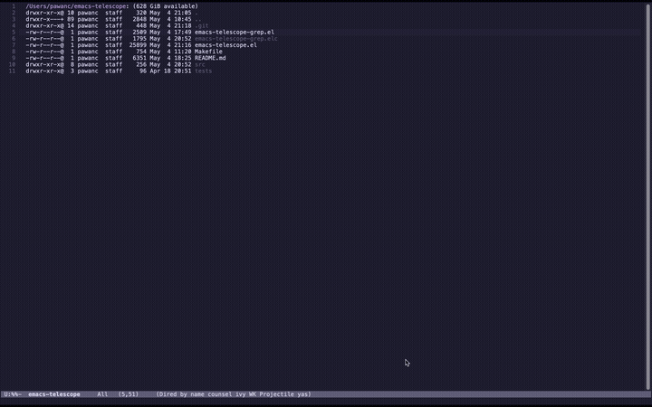

# Emacs Telescope

A fuzzy finder with preview capabilities for Emacs, inspired by [telescope.nvim](https://github.com/nvim-telescope/telescope.nvim) for Neovim.




## Features

- **Live grep filtering** - Type and see grep results update in real-time
- **Search highlighting** - Query terms highlighted in both results and preview
- **Fuzzy finding** - Find files, buffers, and grep results with fuzzy matching
- **Live preview** - See file contents and matched lines as you navigate
- **Project-aware** - Automatically searches within your current project
- **Customizable UI** - Adjust height, width, and preview delay
- **Modular architecture** - Easy to extend with new sources and actions

## Installation

### Manual Installation

1. Clone this repository:
   ```
   git clone https://github.com/yourusername/emacs-telescope.git ~/.emacs.d/site-lisp/emacs-telescope
   ```

2. Add to your Emacs configuration:
   ```elisp
   (add-to-list 'load-path "~/.emacs.d/site-lisp/emacs-telescope")
   (require 'emacs-telescope)
   ```

## Usage

- `M-x emacs-telescope-find-files` - Find files in the current project
- `M-x emacs-telescope-buffers` - Find and switch to open buffers
- `M-x emacs-telescope-grep` - Live grep search with real-time results

### Key Bindings (within Telescope)

- `<up>` / `<down>` - Navigate through items
- `C-n` / `C-p` - Alternative navigation (may not work in all contexts)
- `RET` - Select current item
- `C-g` - Quit telescope

### Live Grep

The grep command now supports live filtering:
1. Run `M-x emacs-telescope-grep`
2. Start typing your search query
3. Results update in real-time as you type
4. Navigate with arrow keys to preview matches
5. Press Enter to jump to the selected match

Search terms are highlighted in both the results list and preview pane.

## Customization

```elisp
;; Customize the UI
(setq emacs-telescope-height 25)
(setq emacs-telescope-width 100)
(setq emacs-telescope-preview-delay 0.1)
```

## Requirements

- Emacs 27.1 or later
- popup.el
- dash.el

## Acknowledgments

- Inspired by [telescope.nvim](https://github.com/nvim-telescope/telescope.nvim)
## Project Structure

The project is organized into several modules with clear separation of concerns:

```
┌─────────────────────────────────────────────────────────────────┐
│                      emacs-telescope.el                         │
│                                                                 │
│  - Core functionality                                           │
│  - Main entry points                                            │
│  - UI management                                                │
│  - Result filtering and selection                               │
└───────────────────┬─────────────────┬───────────────────────────┘
                    │                 │
                    ▼                 ▼
┌─────────────────────────┐  ┌─────────────────────────────────────┐
│ emacs-telescope-grep.el │  │           src/ directory            │
│                         │  │                                     │
│ - Specialized grep      │  │  ┌───────────────────────────────┐  │
│   functionality         │  │  │  emacs-telescope-ui.el        │  │
│ - Project-wide text     │  │  │  - Window layout creation     │  │
│   search                │  │  │  - Buffer setup and styling   │  │
└─────────────────────────┘  │  │  - Display updating           │  │
                             │  └───────────────────────────────┘  │
                             │                                     │
                             │  ┌───────────────────────────────┐  │
                             │  │  emacs-telescope-actions.el   │  │
                             │  │  - File opening               │  │
                             │  │  - Buffer switching           │  │
                             │  │  - Grep result navigation     │  │
                             │  │  - Command execution          │  │
                             │  └───────────────────────────────┘  │
                             │                                     │
                             │  ┌───────────────────────────────┐  │
                             │  │  emacs-telescope-sources.el   │  │
                             │  │  - Project files              │  │
                             │  │  - Open buffers               │  │
                             │  │  - Recent files               │  │
                             │  │  - Grep results               │  │
                             │  │  - Git files and status       │  │
                             │  └───────────────────────────────┘  │
                             └─────────────────────────────────────┘
```

### Component Relationships

1. **Core Module (`emacs-telescope.el`)**
   - Acts as the main entry point for the package
   - Provides the primary user-facing commands
   - Coordinates between UI, actions, and sources
   - Handles user input and selection

2. **Grep Module (`emacs-telescope-grep.el`)**
   - Specialized implementation for text searching
   - Integrates with the core module through function declarations
   - Provides comprehensive file type support for searching

3. **UI Module (`emacs-telescope-ui.el`)**
   - Manages the three-window layout (input, results, preview)
   - Handles buffer setup and styling
   - Updates the display as selections change
   - Provides customization options for appearance

4. **Actions Module (`emacs-telescope-actions.el`)**
   - Defines what happens when items are selected
   - Includes actions for different types of items (files, buffers, grep results)
   - Provides specialized navigation for grep results

5. **Sources Module (`emacs-telescope-sources.el`)**
   - Provides data for the telescope to search
   - Implements filtering for file exclusions
   - Supports various data sources (files, buffers, commands)
   - Integrates with project.el for project-aware searching

